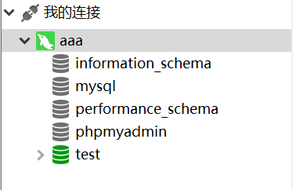

## Koa2 web框架

#### koa2的安装

1. 创建一个包	npm init -y
2. 安装 koa2 包	npm i koa
3. 创建`index.js` 文件
   ```javascript
   const Koa = require('koa')
   const app = new Koa()

   app.use( async ( ctx ) => {
     ctx.body = 'hello koa2'
   })

   app.listen(3000)
   console.log('[demo] start-quick is starting at port 3000')
   ```

```javascript
const Koa = require('koa')
```

默认去找 koa 包的 index.js 文件，如果没有 index.js 文件，就要在 package.json 中找入口文件了。

```javascript
"main": "lib/application.js",
```

这个文件导出了一个类,所以在使用的时候是 new

```javascript
module.exports = class Application extends Emitter { ... }
```

app.use() 是用来加载中间件(第三方的包)。

```javascript
app.listen(3000)
```

监听端口 3000

```javascript
app.use( async ( ctx ) => {
  ctx.body = 'hello koa2'
})
```

app.use() 中可以写异步函数，也可以写同步函数，取决于业务。

ctx.body = 'hello koa2'	属于同步函数，在浏览器中直接能看到结果。

```javascript
function getData(){
  var data
  setTimeout(() => {
    data = Math.random();
  },3000);
  return data;
}
app.use( async ( ctx ) => {
  ctx.body = getData()
})
```

现在什么都打印不出来，只执行同步任务没有执行异步任务，data 是空的值，直接返回了。

```javascript
  var data 
  setTimeout(() => {
    data = Math.random();
  },3000);
  return data;
```

解决方法：使用 async 和 await

```javascript
function getData(){
  return new Promise((resolve,reject) => {
    setTimeout(() => {
      var data = Math.random();
      resolve(data)
    },3000);
  })
}
app.use( async ( ctx ) => {
  ctx.body = await getData()
})
```

#### 自定义中间件

1. 创建文件 log.js

```javascript
function log(ctx) {
  console.log(ctx.method, ctx.header.host + ctx.url)
}
module.exports = function () {
  return async function (ctx, next) {
    log(ctx)
    await next()
  }
}
```

2. 在index.js 中使用 log 中间件

```javascript
const logger = require('./log')
app.use(logger())
```

#### 路由

需求：根据不同的路由访问不同的页面。

创建 views 文件夹存放页面：index.html、todo.html、404.html

```javascript
const Koa = require('koa')
const app = new Koa()
const fs = require('fs')

function render(path){
  let filename = "./views" + path + ".html"
  return new Promise((resolve,reject) => {
    fs.readFile(filename,'utf-8',function(err,data){
      if(err){
        reject(err)
      }else{
        resolve(data)
      }
    })
  })
}

app.use(async (ctx) => {
  let url = ctx.url
  let data
  switch (url) {
      case '/':
      case '/index':
        data = await render('/index')
      break;
      case '/todo':
        data = await render('/todo')
      break;
    default:
        data = await render('/404')
      break;
  }
  ctx.body = data
})

app.listen(3000)
console.log('服务器启动了')
```

#### koa-router

- 安装

```javascript
npm i @koa/router
```

- 引用

```javascript
const Koa = require('koa')
const Router = require('@koa/router')

const app = new Koa()
const router = new Router()

router.get('/', (ctx, next) => {
  ctx.body = "hello"
})

app
  .use(router.routes())
  .use(router.allowedMethods())
app.listen(3000)
console.log('服务器启动了')
```

koa-router 处理客户端传来的参数。

- ctx.querystring

```javascript
router.get('/', (ctx, next) => {
  console.log(ctx.querystring)
})
```

浏览器地址输入：http://localhost:3000/?name=lisi&age=18

控制台返回："name=lisi&age=18"

- ctx.query

```javascript
router.get('/', (ctx, next) => {
  console.log(ctx.query)
})
```

浏览器地址输入：http://localhost:3000/?name=lisi&age=18

控制台返回：{ name: 'lisi', age: '18' }

- ctx.params

```javascript
router.get('/:name/:age', (ctx, next) => {
  console.log(ctx.params)
})
```

浏览器地址输入：http://localhost:3000/lisi/18

控制台返回：{ name: 'lisi', age: '18' }

处理 post 请求传过来的值

- 安装koa2版本的koa-bodyparser@3中间件

```javascript
npm install --save koa-bodyparser@3
```

- 引用 koa-bodyparser@3

```javascript
const bodyParser = require('koa-bodyparser')
// 使用ctx.body解析中间件
app.use(bodyParser())
```

- 接收 post 请求传来的数据

先展示一个提交表单的页面

```javascript
router.get('/', (ctx) => {
  let html = `
  <h1>koa2 request post demo</h1>
  <form method="POST" action="/regist">
    <p>userName</p>
    <input name="userName" /><br/>
    <p>nickName</p>
    <input name="nickName" /><br/>
    <p>email</p>
    <input name="email" /><br/>
    <button type="submit">submit</button>
  </form>
`
  ctx.body = html
})
```

接收 post 请求传来的数据

```javascript
router.post('/regist',(ctx) => {
  console.log(ctx.request.body)
})
```


控制台打印信息：{ userName: '111', nickName: '222', email: '333' }


#### 模板引擎

给页面传递数据

1. 安装 koa-views 中间件：npm install koa-views
2. 安装 ejs：npm i ejs
3. 创建 views 文件夹，放置的都是模板引擎。
4. 创建 index.ejs 文件

```html
<!DOCTYPE html>
<html lang="en">
<head>
  <meta charset="UTF-8">
  <title>Document</title>
</head>
<body>
  <h1>
    <%=title%>
  </h1>
  <p>
    <%=message%>
  </p>
</body>
</html>
```

5. 引用 koa-views 和 ejs

```javascript
const Koa = require('koa')
const app = new Koa()
const views = require('koa-views')
const path = require('path')

// 加载模板引擎
app.use(
  views(path.join(__dirname,"./views"),{
    extension:"ejs"
  })
)

app.use(async (ctx) => {
  let title = "hello koa"
  let message = "first use ejs"
  await ctx.render("index",{
    title,
    message
  })
})
app.listen(3000)
console.log('服务器启动了')
```

```javascript
// 加载模板引擎
app.use(
  views(path.join(__dirname,"./views"),{
    extension:"ejs"
  })
)
```

找到 ejs 文件。

```javascript
  await ctx.render("index",{
    title,
    message
  })
```

给 index.ejs 传递 title 、message 数据。

在 ejs 文件中引入一张图片

如果直接使用 绝对路径引入图片，图片是不可以显示的。使用中间件 koa-static

```javascript
npm install koa-static
```

引入

```javascript
const static = require('koa-static')
app.use(static(
  path.join(__dirname,'./public')   // public 文件夹专门存放静态资源
))
```

在 main.js 文件中

```javascript
   // 默认去找 public 文件
```

#### 连接数据库

1. 打开 XAMPP，启动 mysql 服务


2. 打开 Navicat


可以点击测试连接，看 Navicat 和 MySQL 的连接情况。

默认会有几个数据库



新建数据库 sql，新建表 t_user，插入数据。

3. 下载 mysql 包：npm i mysql
4. 项目中使用 mysql 包

```javascript


var mysql = require('mysql');
var connection = mysql.createConnection({
  host     : 'localhost',
  user     : 'me',
  password : 'secret',
  database : 'my_db'
});
 
connection.connect();
 
connection.query('SELECT 1 + 1 AS solution', function (error, results, fields) {
  if (error) throw error;
  console.log('The solution is: ', results[0].solution);
});
 
connection.end();
```

- 创建一个连接

```javascript
var connection = mysql.createConnection({});
```

```javascript
  host     : 'localhost',   // 连接到本地
  user     : 'root',	    // 用户名
  password : '',	    // 密码
  database : 'sql'	    // 要连接的数据库
```

- 连接

```javascript
connection.connect();
```

- 查询数据库

```javascript
connection.query('select * from t_user', function (error, results, fields) {
  if (error) throw error;
  console.log(results);
});
```

- 关闭连接

```javascript
connection.end();
```

- 执行这个文件，在数据库中查询数据。
